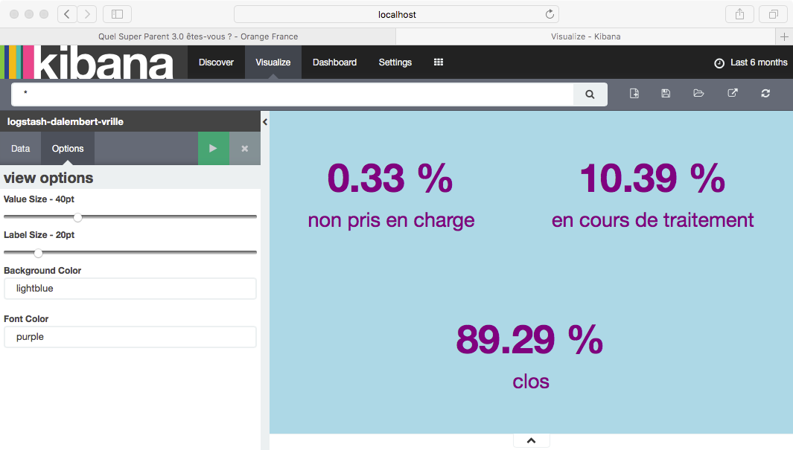

# KibanaRatioCalculation
Small plugin to be able to compute metrics like percentage

# References and Thanks
This plugin is largerly inspired from [Oxalide/kibana_metric_vis_colors](https://github.com/Oxalide/kibana_metric_vis_colors), Kibana legacy metric plugin and [Tim Roes tutorials](https://www.timroes.de/2015/12/06/writing-kibana-4-plugins-visualizations-using-data/) (many thanks to him for his clear and efficient web site).

Thanks to [jpparis-orange](https://github.com/jpparis-orange) for his valuable help on github.


# How to install it

This plugin has only been tested with the following stacks:

| Kibana 4 | 
| ------------- |
|    elasticsearch-2.4.3  |
|    kibana-4.6.2-darwin-x86_64     |

Easiest way is to download the zip file from master branch somewhere and then:

```
bin/kibana plugin --install ratiocalculation -u file:///<path to the zip file>
```

# How to desinstall it

```
bin/kibana plugin --remove ratiocalculation
```

# How to use it

Plugin will appear in the Kibana visualization page, select it.


Then, as usal choose your search source, you will get this:


Metric field (numerator) is useless: we will just count the number of document.
Bucket area allows you te select which filter you want to use or which field you xant to consider.


On the example, we look at "statut.raw" dans we want to know, for each possible value of this field, which percentage it represent of the whole data i.e. we compute (100 * (#document with value1 / #hits)), rounded to 2 decimals.



As you can see you can manager colors and font sizes in the options.

# My apologies

I am far to be senior developer and even far to be a developer :-) I built this plugin because it is useful for us.
Feel free to correct, comment any crap code you will surely find.

